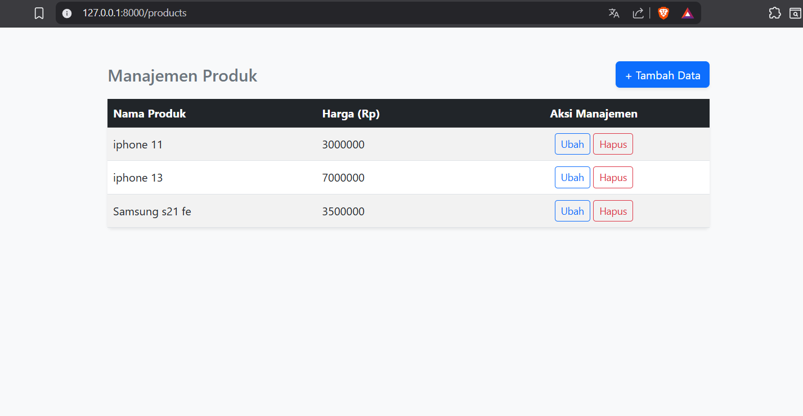
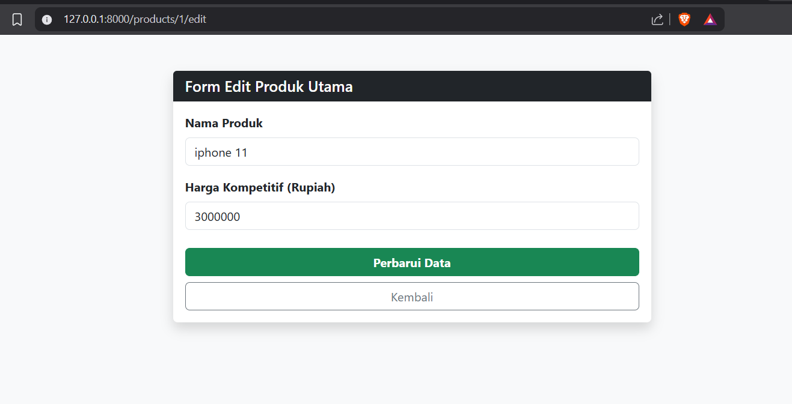
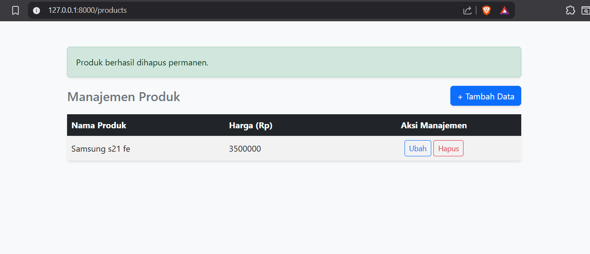

<div align="center">
  <br>

  <h1>LAPORAN PRAKTIKUM<br>APLIKASI BERBASIS PLATFORM</h1>

  <br>

  <h3>MODUL 12<br>LARAVEL: DATABASE 1 (CRUD)</h3>

  <br>

  

  <br><br>

  <h3>Disusun Oleh:</h3>
  <p>
    <strong>Yesika Widiyani</strong><br>
    <strong>2311102195</strong><br>
    <strong>S1 IF-11-04</strong>
  </p>

  <br>

  <h3>Dosen Pengampu:</h3>
  <p><strong>Cahyo Prihantoro, S.Kom., M.Eng.</strong></p>

  <br>

  <h3>
    LABORATORIUM HIGH PERFORMANCE<br>
    FAKULTAS INFORMATIKA<br>
    UNIVERSITAS TELKOM PURWOKERTO<br>
    2026
  </h3>
</div>

---

# 1. Dasar Praktikum

Pada praktikum Modul 12 ini, mahasiswa diminta untuk membuat aplikasi berbasis web menggunakan *framework* Laravel dengan fokus pada pengelolaan *database* melalui operasi CRUD (*Create*, *Read*, *Update*, dan *Delete*). Studi kasus yang digunakan adalah aplikasi manajemen produk sederhana.

Aplikasi ini memungkinkan pengguna untuk melihat daftar produk, menambahkan produk baru, mengubah data produk, dan menghapus data produk. Data produk disimpan pada tabel `products` di *database* SQLite. Laravel digunakan untuk mengatur alur aplikasi melalui konsep MVC (*Model-View-Controller*), yaitu *Model* untuk menghubungkan data, *Controller* untuk mengatur logika aplikasi, dan *View* untuk menampilkan antarmuka kepada pengguna.

---

# 2. Tujuan Praktikum

Tujuan dari praktikum ini adalah:

1. Memahami penggunaan Laravel untuk membuat aplikasi CRUD.
2. Memahami konsep MVC pada Laravel.
3. Memahami penggunaan *migration* untuk membuat tabel *database*.
4. Memahami penggunaan *model* dan Eloquent ORM.
5. Memahami proses validasi data pada *controller*.
6. Memahami penggunaan Blade sebagai template tampilan.
7. Memahami proses menjalankan project Laravel secara lokal.

---

# 3. Dasar Teori

## 3.1 Laravel

Laravel merupakan *framework* PHP yang digunakan untuk membangun aplikasi web secara lebih terstruktur. Laravel menyediakan berbagai fitur seperti *routing*, *controller*, *model*, *migration*, Blade template, validasi, dan keamanan bawaan seperti CSRF protection.

## 3.2 MVC

MVC merupakan singkatan dari *Model-View-Controller*. Pada Laravel, *Model* digunakan untuk berinteraksi dengan data, *View* digunakan untuk menampilkan halaman kepada pengguna, sedangkan *Controller* digunakan untuk mengatur proses bisnis dan menghubungkan *Model* dengan *View*.

## 3.3 CRUD

CRUD adalah operasi dasar dalam pengelolaan data, yaitu *Create* untuk menambahkan data, *Read* untuk menampilkan data, *Update* untuk memperbarui data, dan *Delete* untuk menghapus data. Pada aplikasi ini, CRUD diterapkan pada data produk.

## 3.4 Migration

*Migration* digunakan untuk membuat dan mengatur struktur tabel *database* melalui kode PHP. Dengan *migration*, struktur tabel dapat dibuat secara otomatis tanpa perlu menulis perintah SQL secara manual.

## 3.5 Eloquent ORM

Eloquent ORM merupakan fitur Laravel yang digunakan untuk menghubungkan tabel *database* dengan *model* PHP. Melalui Eloquent, proses menambah, membaca, mengubah, dan menghapus data dapat dilakukan dengan sintaks yang lebih sederhana.

---

# 4. Struktur Project

Struktur utama project ini adalah sebagai berikut:

```text
modul-12-yesika
├── app
│   ├── Http
│   │   └── Controllers
│   │       └── ProductController.php
│   └── Models
│       └── Product.php
├── database
│   ├── migrations
│   │   └── 2026_04_25_062000_create_products_table.php
│   └── seeders
│       └── DatabaseSeeder.php
├── resources
│   └── views
│       ├── products
│       │   ├── form.blade.php
│       │   └── index.blade.php
│       └── template.blade.php
├── routes
│   └── web.php
├── README.md
├── tambahproduk.png
├── viewproduk.png
├── editproduk.png
└── hapusproduk.png
```

---

# 5. Source Code Praktikum

## 5.1 Route

File: `routes/web.php`

```php
<?php

use Illuminate\Support\Facades\Route;
use App\Http\Controllers\ProductController;

Route::get('/', function () {
    return redirect()->route('products.index');
});

Route::resource('products', ProductController::class);
```

Kode di atas digunakan untuk mengarahkan halaman utama ke halaman daftar produk. Selain itu, `Route::resource` digunakan untuk membuat route CRUD secara otomatis, seperti menampilkan data, menambah data, mengubah data, dan menghapus data produk.

## 5.2 Model

File: `app/Models/Product.php`

```php
<?php

namespace App\Models;

use Illuminate\Database\Eloquent\Factories\HasFactory;
use Illuminate\Database\Eloquent\Model;

class Product extends Model
{
    use HasFactory;

    protected $fillable = [
        'name',
        'price'
    ];
}
```

Model `Product` digunakan untuk menghubungkan aplikasi dengan tabel `products`. Properti `$fillable` digunakan untuk menentukan kolom yang boleh diisi melalui proses input data.

## 5.3 Migration

File: `database/migrations/2026_04_25_062000_create_products_table.php`

```php
<?php

use Illuminate\Database\Migrations\Migration;
use Illuminate\Database\Schema\Blueprint;
use Illuminate\Support\Facades\Schema;

return new class extends Migration
{
    public function up(): void
    {
        Schema::create('products', function (Blueprint $table) {
            $table->id();
            $table->string('name', 150);
            $table->unsignedInteger('price');
            $table->timestamps();
        });
    }

    public function down(): void
    {
        Schema::dropIfExists('products');
    }
};
```

Migration di atas digunakan untuk membuat tabel `products`. Tabel tersebut memiliki kolom `id`, `name`, `price`, `created_at`, dan `updated_at`.

## 5.4 Controller

File: `app/Http/Controllers/ProductController.php`

```php
<?php

namespace App\Http\Controllers;

use App\Models\Product;
use Illuminate\Http\Request;
use Illuminate\Support\Facades\Log;

class ProductController extends Controller
{
    public function index()
    {
        $products = Product::all();
        return view('products.index', ['products' => $products]);
    }

    public function create()
    {
        return view('products.form', [
            'title' => 'Tambah',
            'product' => new Product(),
            'route' => route('products.store'),
            'method' => 'POST',
        ]);
    }

    public function store(Request $request)
    {
        $validated = $request->validate([
            'name' => 'required|string|min:4|max:100',
            'price' => 'required|integer|min:1000000',
        ]);

        Product::create($validated);

        return redirect()
            ->route('products.index')
            ->with('success', 'Produk berhasil ditambahkan.');
    }

    public function edit(Product $product)
    {
        return view('products.form', [
            'title' => 'Edit',
            'product' => $product,
            'route' => route('products.update', $product),
            'method' => 'PUT',
        ]);
    }

    public function update(Request $request, Product $product)
    {
        $validated = $request->validate([
            'name' => 'required|string|min:4|max:100',
            'price' => 'required|integer|min:1000000',
        ]);

        $product->update($validated);

        return redirect()
            ->route('products.index')
            ->with('success', 'Produk berhasil diperbarui.');
    }

    public function destroy(Product $product)
    {
        $product->delete();

        return redirect()
            ->route('products.index')
            ->with('success', 'Produk berhasil dihapus permanen.');
    }
}
```

Controller di atas digunakan untuk mengatur seluruh proses CRUD. Fungsi `index()` digunakan untuk menampilkan data, `create()` untuk membuka form tambah data, `store()` untuk menyimpan data, `edit()` untuk membuka form edit data, `update()` untuk memperbarui data, dan `destroy()` untuk menghapus data.

---

# 6. Output Program

## 6.1 Tampilan Daftar Produk

Halaman ini menampilkan daftar produk yang sudah tersimpan di *database*. Pada halaman ini terdapat tombol `Tambah Data`, tombol `Ubah`, dan tombol `Hapus`.



## 6.2 Tampilan Tambah Produk

Halaman ini digunakan untuk menambahkan data produk baru. Pengguna perlu mengisi nama produk dan harga produk, kemudian menekan tombol `Simpan Baru`.


## 6.3 Tampilan Edit Produk

Halaman ini digunakan untuk mengubah data produk yang sudah ada. Data lama akan muncul pada form, kemudian pengguna dapat memperbaruinya.



## 6.4 Tampilan Hapus Produk

Fitur hapus digunakan untuk menghapus data produk dari tabel. Sebelum data dihapus, sistem menampilkan konfirmasi agar pengguna tidak menghapus data secara tidak sengaja.



---

# 7. Langkah Menjalankan Project

Ikuti langkah berikut untuk menjalankan project di laptop:

## 7.1 Buka Folder Project

Buka folder `modul-12-yesika` menggunakan Visual Studio Code.

Pastikan di dalam folder terdapat file berikut:

```text
artisan
composer.json
routes
app
resources
database
```

## 7.2 Install Dependency Laravel

Jalankan perintah berikut di terminal Visual Studio Code:

```bash
composer install
```

Perintah ini akan membuat folder `vendor`. Folder `vendor` memang tidak dimasukkan ke GitHub karena ukurannya besar dan bisa dibuat ulang menggunakan Composer.

## 7.3 Buat File `.env`

Jalankan perintah berikut:

```bash
copy .env.example .env
```

Jika menggunakan Git Bash atau terminal Linux, gunakan:

```bash
cp .env.example .env
```

## 7.4 Generate Application Key

Jalankan perintah berikut:

```bash
php artisan key:generate
```

## 7.5 Pastikan File Database SQLite Ada

Jika file `database/database.sqlite` belum ada, buat menggunakan perintah berikut:

```bash
New-Item database/database.sqlite -ItemType File -Force
```

Jika menggunakan Git Bash atau Linux, gunakan:

```bash
touch database/database.sqlite
```

## 7.6 Jalankan Migration dan Seeder

Jalankan perintah berikut:

```bash
php artisan migrate:fresh --seed
```

Perintah ini digunakan untuk membuat ulang tabel dan mengisi data awal produk.

## 7.7 Jalankan Server Laravel

Jalankan perintah berikut:

```bash
php artisan serve
```

Setelah server berjalan, buka alamat berikut di browser:

```text
http://127.0.0.1:8000
```

---

# 8. Pengujian Program

| No | Skenario Pengujian | Hasil yang Diharapkan | Status |
|---|---|---|---|
| 1 | Membuka halaman utama | Sistem menampilkan halaman daftar produk | Berhasil |
| 2 | Klik tombol `Tambah Data` | Sistem menampilkan form tambah produk | Berhasil |
| 3 | Menyimpan produk baru | Data produk berhasil tersimpan | Berhasil |
| 4 | Klik tombol `Ubah` | Sistem menampilkan form edit produk | Berhasil |
| 5 | Memperbarui data produk | Data produk berhasil diperbarui | Berhasil |
| 6 | Klik tombol `Hapus` | Sistem menghapus data produk | Berhasil |

---

# 9. Langkah Memasukkan Project ke GitHub

Gunakan cara ini agar folder lama di repository tidak ikut berubah atau terhapus.

## 9.1 Masukkan Folder ke Repository Lokal

Pindahkan folder `modul-12-yesika` ke dalam folder repository kamu, misalnya:

```text
C:\Users\Yesika Widiyani\OneDrive\Documents\ABP\modul-12-yesika
```

## 9.2 Buka Terminal di Folder Repository Utama

Buka terminal di folder utama repository, misalnya:

```text
C:\Users\Yesika Widiyani\OneDrive\Documents\ABP
```

Jangan menjalankan perintah Git dari folder yang salah.

## 9.3 Cek Status Git

```bash
git status
```

Pastikan tidak ada file lama yang terbaca sebagai `deleted`. Jika ada, jangan lanjut dulu.

## 9.4 Ambil Update Terbaru dari GitHub

Karena repository bisa saja sudah memiliki perubahan terbaru, jalankan:

```bash
git pull --rebase origin master
```

Jika branch kamu menggunakan `main`, gunakan:

```bash
git pull --rebase origin main
```

## 9.5 Tambahkan Hanya Folder Project Ini

Jika repository kamu memakai branch `master`, jalankan:

```bash
git add modul-12-yesika/
git status
git commit -m "Menambahkan tugas Modul 12 Laravel CRUD"
git push origin master
```

Jika repository kamu memakai branch `main`, jalankan:

```bash
git add modul-12-yesika/
git status
git commit -m "Menambahkan tugas Modul 12 Laravel CRUD"
git push origin main
```

Catatan penting: jangan langsung memakai `git add .` jika masih ada folder lain yang belum jelas statusnya. Perintah tersebut bisa membuat file lain ikut masuk ke commit.

---

# 10. Kesimpulan

Berdasarkan praktikum yang telah dilakukan, aplikasi manajemen produk berbasis Laravel berhasil dibuat dengan fitur CRUD. Aplikasi dapat menampilkan daftar produk, menambahkan data produk, mengubah data produk, dan menghapus data produk. Laravel membantu proses pengembangan menjadi lebih terstruktur melalui penggunaan route, controller, model, migration, dan Blade template. Dengan adanya validasi pada controller dan penggunaan CSRF token pada form, aplikasi juga memiliki dasar keamanan yang baik dalam proses pengelolaan data.
