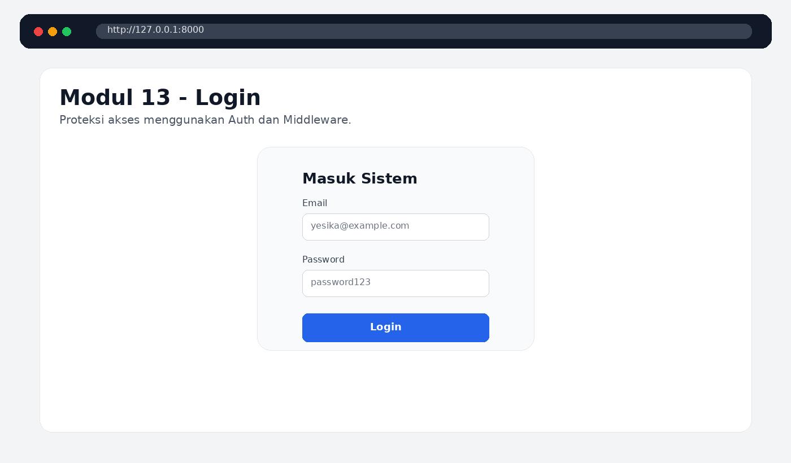
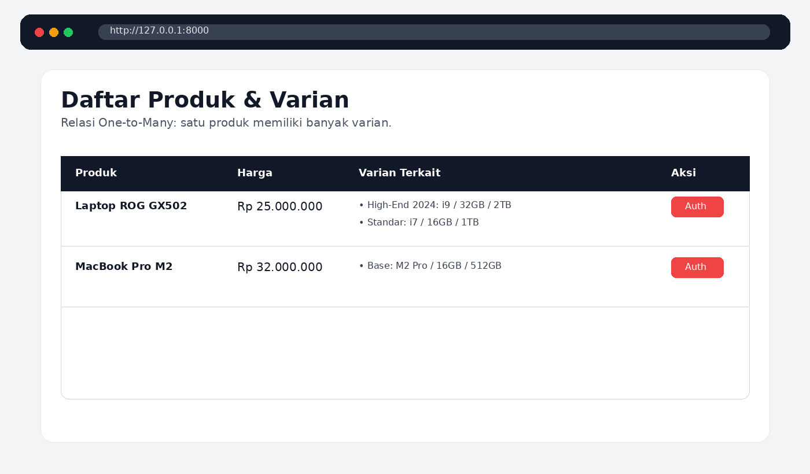
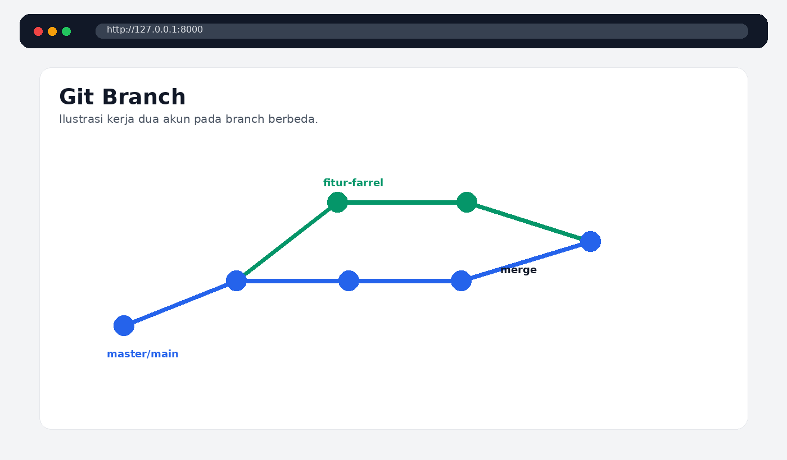
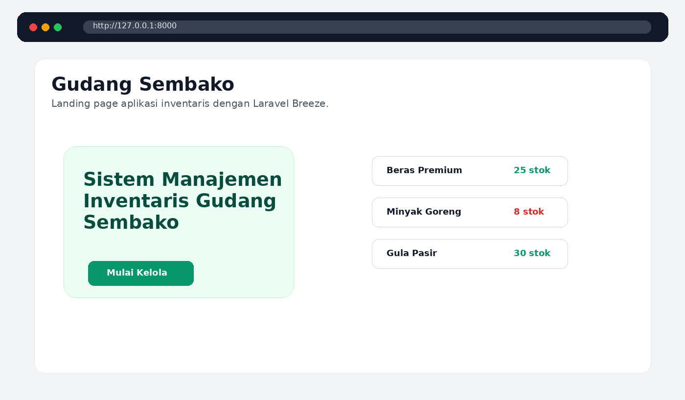
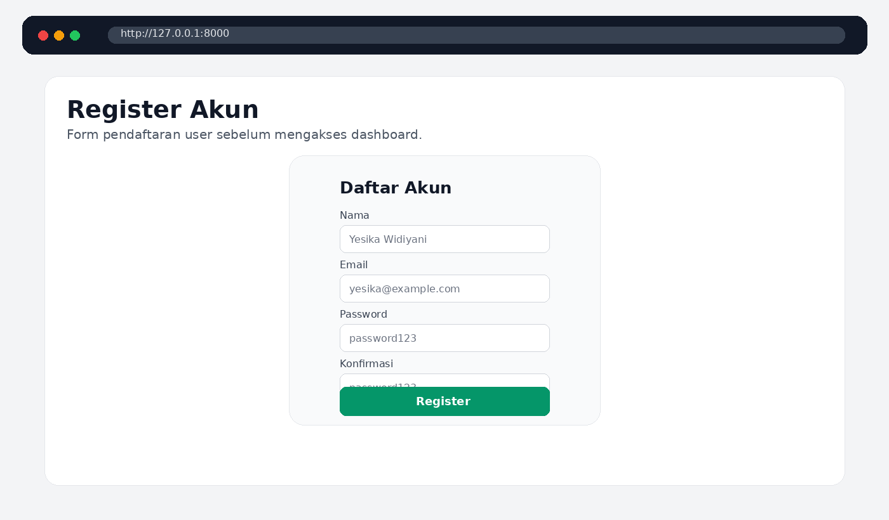
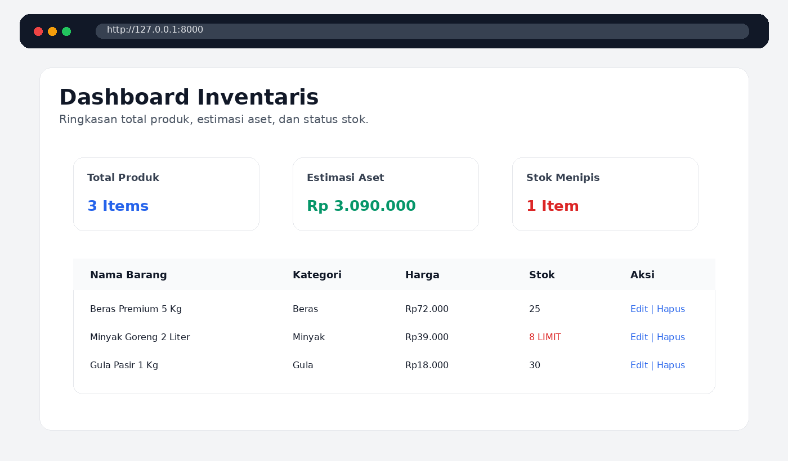
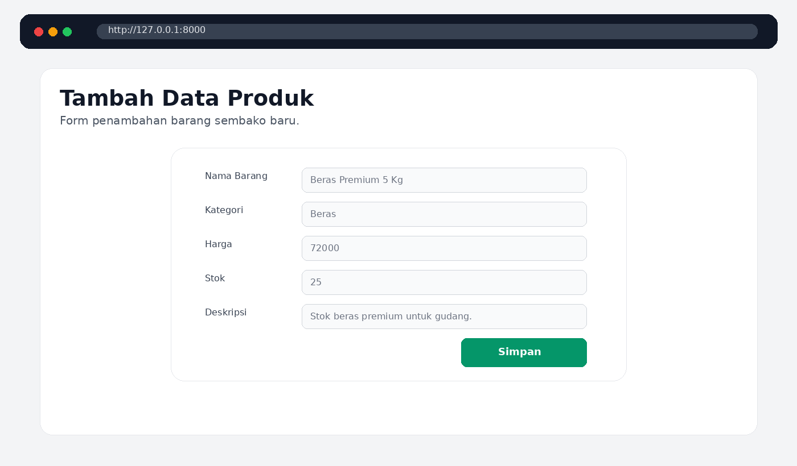
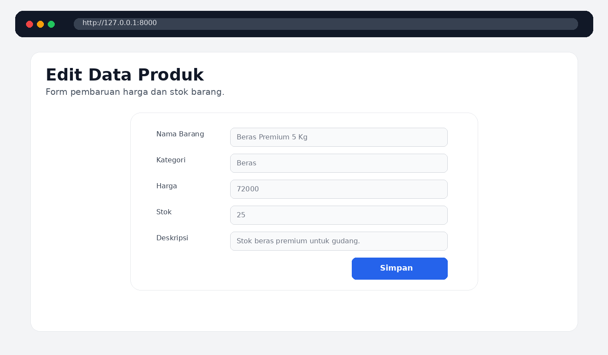

<div align="center">

# LAPORAN PRAKTIKUM  
# APLIKASI BERBASIS PLATFORM

## MODUL 13  
## LARAVEL: DATABASE 2, AUTH, MIDDLEWARE & RELATIONS


Disusun oleh:  
**Yesika Widiyani**  
**2311102195**  
**S1 IF-11-04**

Dosen Pengampu:  
**Cahyo Prihantoro, S.Kom., M.Eng.**

**PROGRAM STUDI S1 INFORMATIKA**  
**DIREKTORAT KAMPUS PURWOKERTO – UNIVERSITAS TELKOM**  
**2026**

</div>

---

# 1. Dasar Praktikum

Pada praktikum modul 13, pengembangan aplikasi Laravel difokuskan pada penggunaan database tingkat lanjut, autentikasi, middleware, dan relasi antar tabel. Praktikum ini terdiri dari dua bagian utama, yaitu project `laravel-modul13` yang membahas login, middleware auth, dan relasi One-to-Many antara produk dan varian, serta project `tugas-8` yang berisi aplikasi inventaris gudang sembako dengan fitur autentikasi dan CRUD produk.

---

# 2. Dasar Teori

## 2.1 Session

Session adalah mekanisme penyimpanan data sementara pada sisi server yang digunakan untuk mengenali aktivitas pengguna selama menggunakan aplikasi. Dalam Laravel, session sering digunakan untuk menyimpan status login, pesan notifikasi, dan data sementara lainnya.

## 2.2 Authentication

Authentication adalah proses pengecekan identitas pengguna sebelum pengguna dapat mengakses fitur tertentu. Pada Laravel, proses login dapat dilakukan menggunakan fitur Auth. Password pengguna disimpan dalam bentuk hash, sehingga lebih aman dibandingkan menyimpan password asli secara langsung.

## 2.3 Middleware

Middleware berfungsi sebagai lapisan pemeriksa request sebelum masuk ke controller. Pada praktikum ini, middleware `auth` digunakan untuk membatasi akses halaman produk. Jika pengguna belum login, maka pengguna akan diarahkan ke halaman login.

## 2.4 Relasi One-to-Many

Relasi One-to-Many adalah hubungan satu data utama dengan banyak data turunan. Pada project `laravel-modul13`, satu produk dapat memiliki banyak varian. Relasi ini dibuat dengan model `Product` sebagai induk dan model `Variant` sebagai data turunan.

---

# 3. Project 1: Laravel Modul 13

Project pertama berada pada folder:

```text
laravel-modul13
```

Project ini digunakan untuk menerapkan login manual, middleware auth, dan relasi antara tabel `products` dan `variants`.

## 3.1 Route `routes/web.php`

```php
<?php

use Illuminate\Support\Facades\Route;
use Illuminate\Support\Facades\Auth;
use App\Http\Controllers\SiteController;
use App\Http\Controllers\ProductController;

Route::get('/', function () {
    return redirect('/product');
});

Route::get('/login', function () {
    if (Auth::check()) {
        return redirect('/product');
    }
    return view('login');
})->name('login');

Route::post('/login', [SiteController::class, 'auth'])->name('login.post');

Route::get('/logout', function () {
    Auth::logout();
    session()->invalidate();
    session()->regenerateToken();
    return redirect('/login');
})->name('logout');

Route::resource('product', ProductController::class)->middleware('auth');
```

Kode di atas mengatur alur halaman login, logout, dan route produk. Route produk diberi middleware `auth`, sehingga hanya pengguna yang sudah login yang dapat mengakses halaman tersebut.

## 3.2 Controller Login `SiteController.php`

```php
<?php

namespace App\Http\Controllers;

use Illuminate\Http\Request;
use Illuminate\Support\Facades\Auth;
use Illuminate\Support\Facades\Log;

class SiteController extends Controller
{
    public function auth(Request $request)
    {
        $credentials = $request->validate([
            'email' => 'required|email|max:150',
            'password' => 'required|string|min:6',
        ]);

        try {
            if (Auth::attempt(['email' => $request->email, 'password' => $request->password])) {
                $request->session()->regenerate();
                session()->put('name', Auth::user()->name);
                return redirect()->intended('/product');
            }

            return redirect('/login')->with('msg', 'Email atau password tidak valid.');
        } catch (\Exception $e) {
            Log::error('Kesalahan autentikasi: ' . $e->getMessage());
            return redirect('/login')->with('msg', 'Terjadi kesalahan internal server.');
        }
    }
}
```

Controller tersebut digunakan untuk memvalidasi email dan password. Jika data login sesuai dengan data user pada database, maka user diarahkan ke halaman produk.

## 3.3 Model Product dan Variant

```php
class Product extends Model
{
    use HasFactory;

    protected $fillable = ['name', 'price'];

    public function variants()
    {
        return $this->hasMany(Variant::class);
    }
}
```

```php
class Variant extends Model
{
    use HasFactory;

    protected $fillable = [
        'name', 'description', 'processor',
        'memory', 'storage', 'product_id'
    ];

    public function product()
    {
        return $this->belongsTo(Product::class);
    }
}
```

Model `Product` memiliki relasi `hasMany` ke model `Variant`, sedangkan model `Variant` memiliki relasi `belongsTo` ke model `Product`.

## 3.4 Output Project Laravel Modul 13

### Tampilan Login



### Tampilan Data Produk dan Varian



---

# 4. Tugas Pertemuan 8

## 4.1 Penjelasan Git Branch

Git branch adalah fitur pada Git yang digunakan untuk membuat jalur kerja terpisah dari branch utama. Branch memungkinkan pengembang menambahkan fitur baru, memperbaiki bug, atau melakukan percobaan tanpa mengganggu kode utama yang sudah stabil.

## 4.2 Fungsi Git Branch

Fungsi Git branch antara lain:

1. Memisahkan proses pengembangan fitur dari branch utama.
2. Memudahkan kerja tim dalam satu repository.
3. Mengurangi risiko kerusakan pada kode utama.
4. Memudahkan proses review sebelum perubahan digabungkan.
5. Membantu pengelolaan versi aplikasi.

## 4.3 Keuntungan Git Branch

Keuntungan menggunakan Git branch adalah pengembangan aplikasi menjadi lebih aman dan terstruktur. Jika kode pada branch baru mengalami error, maka branch utama tidak ikut terganggu. Selain itu, setiap anggota tim dapat mengerjakan fitur berbeda secara bersamaan.

## 4.4 Contoh Perintah Git Branch

| Perintah | Fungsi |
| --- | --- |
| `git branch` | Menampilkan daftar branch lokal |
| `git branch nama_branch` | Membuat branch baru |
| `git checkout nama_branch` | Berpindah ke branch tertentu |
| `git checkout -b nama_branch` | Membuat branch baru sekaligus berpindah ke branch tersebut |
| `git merge nama_branch` | Menggabungkan branch ke branch aktif |
| `git branch -d nama_branch` | Menghapus branch lokal |

## 4.5 Output Git Branch



---

# 5. Project 2: Website Inventaris Gudang Sembako

Project kedua berada pada folder:

```text
tugas-8
```

Project ini merupakan website inventaris gudang sembako berbasis Laravel Breeze. Aplikasi memiliki fitur register, login, dashboard, tambah data produk, edit data produk, hapus data produk, dan tampilan stok barang.

## 5.1 Fitur Website

1. Register akun pengguna.
2. Login dan logout.
3. Dashboard inventaris produk.
4. Tambah data produk.
5. Edit data produk.
6. Hapus data produk.
7. Indikator stok menipis.

## 5.2 Route `routes/web.php`

```php
<?php

use App\Http\Controllers\ProfileController;
use App\Http\Controllers\ProductController;
use Illuminate\Support\Facades\Route;

Route::get('/', function () {
    return view('welcome');
});

Route::get('/dashboard', function () {
    return redirect()->route('product.index');
})->middleware(['auth', 'verified'])->name('dashboard');

Route::middleware('auth')->group(function () {
    Route::resource('product', ProductController::class);

    Route::get('/profile', [ProfileController::class, 'edit'])->name('profile.edit');
    Route::patch('/profile', [ProfileController::class, 'update'])->name('profile.update');
    Route::delete('/profile', [ProfileController::class, 'destroy'])->name('profile.destroy');
});

require __DIR__.'/auth.php';
```

Route di atas menunjukkan bahwa fitur produk hanya dapat diakses oleh user yang sudah login. Jika user belum login, maka user harus melakukan register atau login terlebih dahulu.

## 5.3 Migration Produk

```php
Schema::create('products', function (Blueprint $table) {
    $table->id();
    $table->string('name');
    $table->string('category');
    $table->integer('price');
    $table->integer('stock');
    $table->text('description')->nullable();
    $table->timestamps();
});
```

Migration di atas digunakan untuk membuat tabel `products` dengan kolom nama barang, kategori, harga, stok, dan deskripsi.

## 5.4 Controller Produk

```php
class ProductController extends Controller
{
    public function index()
    {
        $products = Product::latest()->get();
        return view('product.index', compact('products'));
    }

    public function create()
    {
        return view('product.create');
    }

    public function store(Request $request)
    {
        $request->validate([
            'name' => 'required',
            'category' => 'required',
            'price' => 'required|numeric',
            'stock' => 'required|numeric',
            'description' => 'nullable',
        ]);

        Product::create($request->all());
        return redirect()->route('product.index')->with('success', 'Produk sembako berhasil ditambahkan.');
    }
}
```

Controller tersebut digunakan untuk menghubungkan request dari form dengan tabel produk pada database.

## 5.5 Output Website

### Landing Page



### Register



### Dashboard Admin



### Tambah Data Produk



### Edit Data Produk



---
