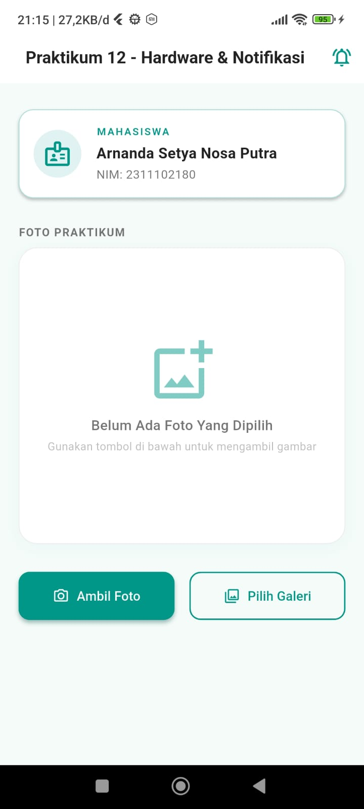
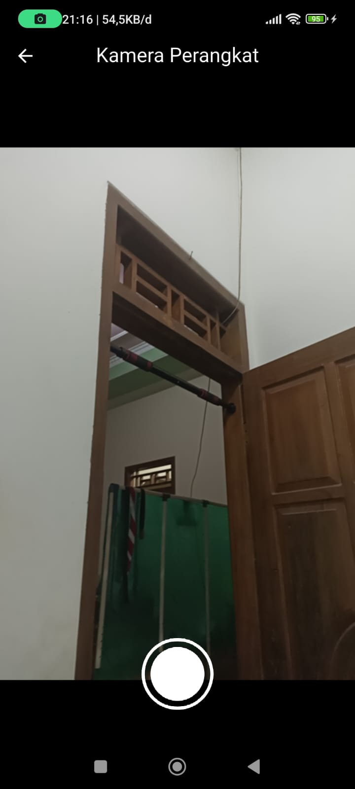
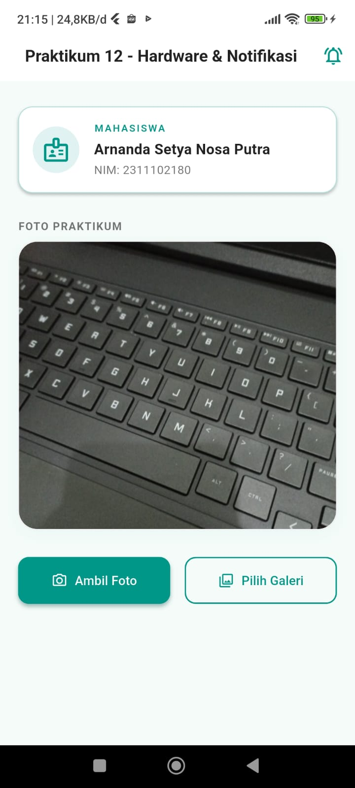
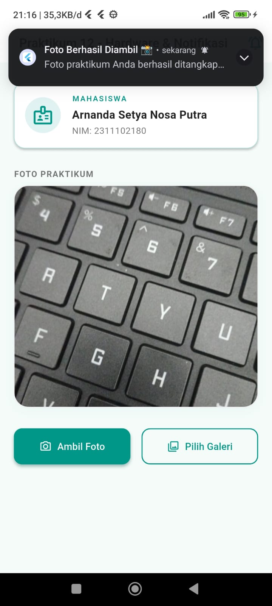
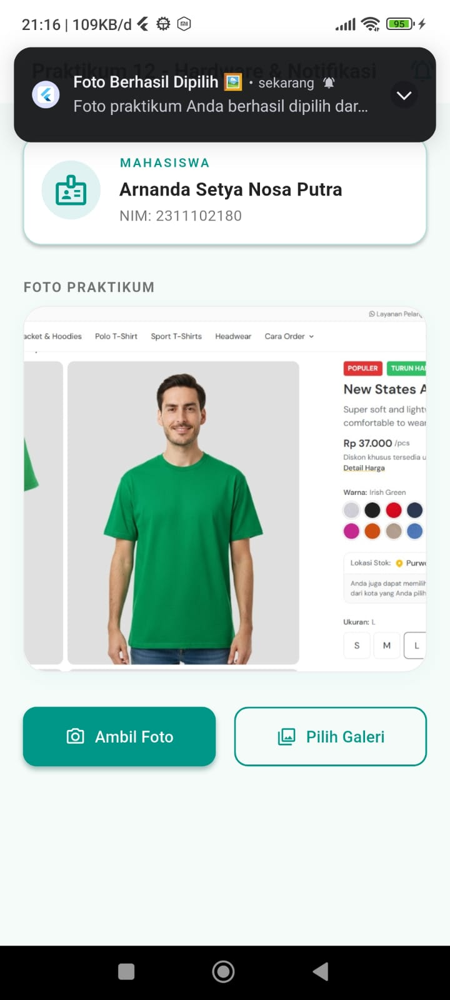

# LAPORAN PRAKTIKUM  
# APLIKASI BERBASIS PLATFORM  

## PERTEMUAN 12 - FLUTTER KAMERA, GALERI, DAN NOTIFIKASI LOKAL

<p align="center">
  
</p>

<p align="center">
  Disusun oleh:<br>
  <b>Yesika Widiyani</b><br>
  <b>2311102195</b><br>
  <b>S1 IF-11-04</b>
</p>

<p align="center">
  Dosen Pengampu:<br>
  <b>Cahyo Prihantoro, S.Kom., M.Eng.</b>
</p>

<p align="center">
  <b>PROGRAM STUDI S1 INFORMATIKA</b><br>
  <b>DIREKTORAT KAMPUS PURWOKERTO - UNIVERSITAS TELKOM</b><br>
  <b>2026</b>
</p>

---

## 1. Penjelasan Singkat

Project ini merupakan aplikasi Flutter untuk Pertemuan 12 yang membahas penggunaan API perangkat keras dan notifikasi lokal. Fitur utama aplikasi adalah mengambil foto menggunakan kamera perangkat, memilih gambar dari galeri, menampilkan gambar pada halaman utama, dan menampilkan notifikasi lokal setelah gambar berhasil diambil atau dipilih.

Aplikasi ini menggunakan beberapa package Flutter, yaitu `camera` untuk membuka kamera perangkat, `image_picker` untuk memilih gambar dari galeri, dan `flutter_local_notifications` untuk menampilkan notifikasi lokal pada perangkat Android.

---

## 2. Fitur Aplikasi

Fitur yang terdapat pada aplikasi ini adalah:

1. Menampilkan identitas mahasiswa.
2. Mengambil foto menggunakan kamera perangkat.
3. Memilih gambar dari galeri.
4. Menampilkan preview gambar yang dipilih atau diambil.
5. Menampilkan notifikasi lokal setelah gambar berhasil diproses.
6. Menyediakan tombol notifikasi manual pada bagian AppBar.

---

## 3. Widget yang Digunakan

### 3.1 `MyApp`

Widget `MyApp` merupakan root aplikasi. Widget ini mengatur `MaterialApp`, tema aplikasi, warna utama, dan menentukan `HomePage` sebagai halaman pertama.

### 3.2 `HomePage`

Widget `HomePage` merupakan halaman utama aplikasi. Di dalamnya terdapat kartu identitas mahasiswa, area preview foto, tombol ambil foto, tombol pilih galeri, dan tombol notifikasi manual.

### 3.3 `CameraScreen`

Widget `CameraScreen` digunakan untuk membuka kamera perangkat. Widget ini menggunakan `CameraController`, `FutureBuilder`, dan `CameraPreview` agar kamera dapat ditampilkan secara langsung sebelum pengguna mengambil gambar.

### 3.4 `FlutterLocalNotificationsPlugin`

Plugin ini digunakan untuk membuat dan menampilkan notifikasi lokal. Notifikasi akan muncul ketika pengguna berhasil mengambil foto dari kamera atau memilih gambar dari galeri.

---

## 4. Struktur Project

```text
2311102195-YESIKA WIDIYANI-PERTEMUAN12
├── README.md
├── LAPORAN_PRAKTIKUM.md
├── SS
│   ├── hal_utama_kosong.jpeg
│   ├── hal_utama_camera.jpeg
│   ├── hal_utama_gallery.jpeg
│   ├── kamera_aktif.jpeg
│   ├── notifikasi_camera.jpeg
│   └── notifikasi_gallery.jpeg
└── tugas-12
    ├── android
    ├── ios
    ├── lib
    │   └── main.dart
    ├── test
    ├── web
    └── pubspec.yaml
```

---

## 5. Output Program

### 5.1 Tampilan Awal

Tampilan awal menunjukkan identitas mahasiswa dan area preview foto yang masih kosong.



### 5.2 Tampilan Kamera Aktif

Tampilan ini muncul ketika pengguna menekan tombol `Ambil Foto`. Kamera perangkat akan aktif dan menampilkan preview kamera.



### 5.3 Tampilan Setelah Mengambil Foto dari Kamera

Setelah foto berhasil diambil, gambar akan tampil pada halaman utama aplikasi.



### 5.4 Notifikasi Setelah Mengambil Foto

Aplikasi menampilkan notifikasi lokal setelah foto berhasil diambil melalui kamera.



### 5.5 Tampilan Setelah Memilih Foto dari Galeri

Setelah pengguna memilih foto dari galeri, gambar akan ditampilkan pada halaman utama.



### 5.6 Notifikasi Setelah Memilih Foto dari Galeri

Aplikasi menampilkan notifikasi lokal setelah foto berhasil dipilih dari galeri.


---

## 6. Cara Menjalankan Project

Catatan penting: project ini menggunakan kamera perangkat dan notifikasi lokal, jadi paling tepat dijalankan di HP Android atau emulator Android. Jangan memaksakan menjalankan di Chrome, karena package kamera dan notifikasi tidak selalu berjalan normal di web.

### 6.1 Buka Folder Project

Buka folder berikut di VS Code:

```text
2311102195-YESIKA WIDIYANI-PERTEMUAN12\tugas-12
```

Pastikan terminal berada di folder yang memiliki file `pubspec.yaml`.

### 6.2 Install Dependency

Jalankan perintah berikut:

```bash
flutter pub get
```

### 6.3 Cek Device

Jalankan:

```bash
flutter devices
```

Jika HP Android sudah terhubung atau emulator sudah aktif, device akan muncul pada daftar.

### 6.4 Jalankan Aplikasi

Jika ingin menjalankan pada device Android yang terdeteksi:

```bash
flutter run
```

Jika terdapat beberapa device, gunakan ID device. Contoh:

```bash
flutter run -d <device_id>
```

### 6.5 Menghentikan Aplikasi

Untuk menghentikan aplikasi dari terminal, tekan:

```bash
q
```

atau tekan:

```bash
CTRL + C
```

Jika muncul pertanyaan `Terminate batch job (Y/N)?`, ketik `Y`, lalu tekan Enter.

---

## 7. Langkah Memasukkan ke Git

Jalankan perintah berikut dari folder utama repository `ABP`, bukan dari dalam folder `tugas-12`.

### 7.1 Masuk ke Folder ABP

```bash
cd "C:\Users\Yesika Widiyani\OneDrive\Documents\ABP"
```

### 7.2 Cek Status Repository

```bash
git status
```

### 7.3 Tambahkan Folder Pertemuan 12

```bash
git add "2311102195-YESIKA WIDIYANI-PERTEMUAN12/"
```

### 7.4 Cek Ulang File yang Akan Masuk Commit

```bash
git status
```

Pastikan yang masuk hanya folder `2311102195-YESIKA WIDIYANI-PERTEMUAN12/`. Jangan gunakan `git add .` jika masih ada folder lain yang belum jelas.

### 7.5 Commit

```bash
git commit -m "Menambahkan Pertemuan 12 Yesika"
```

### 7.6 Push ke GitHub

```bash
git push origin master
```

Jika push ditolak karena repository GitHub lebih baru, jalankan:

```bash
git pull --rebase origin master
git push origin master
```

---

## 8. Kesimpulan

Berdasarkan praktikum yang telah dilakukan, aplikasi Flutter berhasil dibuat untuk memanfaatkan kamera perangkat, memilih gambar dari galeri, dan menampilkan notifikasi lokal. Aplikasi ini menunjukkan bagaimana Flutter dapat berinteraksi dengan fitur perangkat keras melalui package tambahan, serta memberikan respons kepada pengguna melalui notifikasi lokal.
