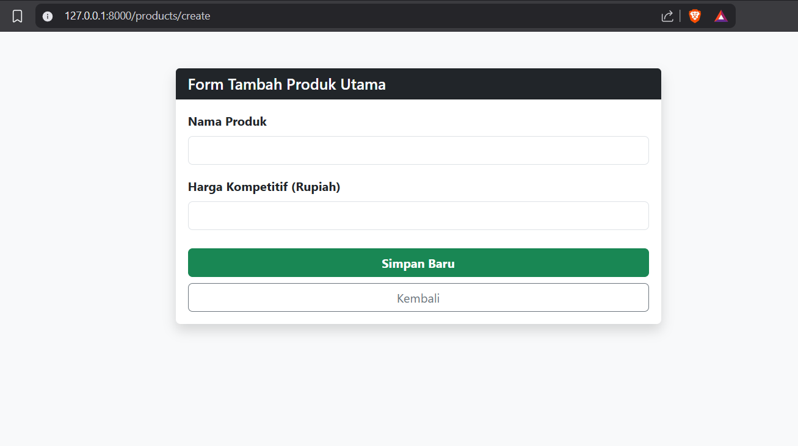
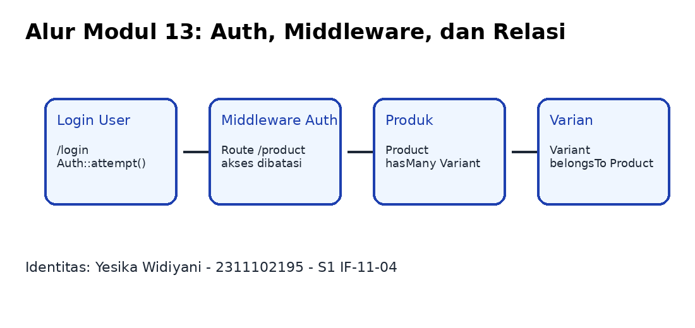

# LAPORAN PRAKTIKUM APLIKASI BERBASIS PLATFORM

## PERTEMUAN 8

<div align="center">


<br><br>

Disusun oleh:

**Yesika Widiyani**  
**2311102195**  
**S1 IF-11-04**

Dosen Pengampu:

**Cahyo Prihantoro, S.Kom., M.Eng.**

**PROGRAM STUDI S1 INFORMATIKA**  
**DIREKTORAT KAMPUS PURWOKERTO – UNIVERSITAS TELKOM**  
**2026**

</div>

---

## Daftar Project

Repository ini berisi project Pertemuan 8 dengan dua bagian utama:

1. `modul-12-yesika`  
   Project Laravel CRUD produk. Fitur utama yang dibuat adalah menampilkan data produk, menambah produk, mengedit produk, dan menghapus produk.

2. `modul-13-yesika`  
   Project Laravel lanjutan yang berisi penerapan autentikasi, middleware, session, dan relasi database. Di dalamnya terdapat project `laravel-modul13` dan `tugas-8`.

---

## Identitas Praktikan

| Keterangan | Isi |
|---|---|
| Nama | Yesika Widiyani |
| NIM | 2311102195 |
| Kelas | S1 IF-11-04 |
| Mata Kuliah | Aplikasi Berbasis Platform |
| Pertemuan | 8 |

---

## Dasar Praktikum

Praktikum ini membahas pengembangan aplikasi berbasis web menggunakan framework Laravel. Pada bagian pertama, Laravel digunakan untuk membuat aplikasi CRUD sederhana pada data produk. Pada bagian berikutnya, Laravel digunakan untuk mengimplementasikan autentikasi, middleware, session, serta relasi antar tabel.

Secara umum, praktikum ini bertujuan agar mahasiswa memahami alur kerja Laravel mulai dari konfigurasi project, pembuatan route, controller, model, migration, blade view, hingga pengujian aplikasi melalui browser.

---

## Output Modul 12

### Tampilan Data Produk


### Tampilan Tambah Produk



### Tampilan Edit Produk


### Tampilan Hapus Produk


---

## Output Modul 13

Modul 13 berfokus pada autentikasi, middleware, dan relasi antar tabel. Alur sederhananya adalah pengguna melakukan login, kemudian akses ke halaman produk dibatasi menggunakan middleware auth. Setelah berhasil login, pengguna dapat melihat data produk dan relasi variannya.



Akun login yang digunakan untuk project `laravel-modul13`:

```text
Email    : yesika@example.com
Password : password123
```

---

## Cara Menjalankan Modul 12

Masuk ke folder `modul-12-yesika`:

```bash
cd "2311102195-YESIKA WIDIYANI-PERTEMUAN8/modul-12-yesika"
```

Jalankan perintah berikut:

```bash
composer install
Copy-Item .env.example .env
php artisan key:generate
php artisan migrate:fresh --seed
php artisan serve
```

Buka browser:

```text
http://127.0.0.1:8000
```

Kalau menggunakan Git Bash dan perintah `Copy-Item` tidak bisa, gunakan:

```bash
cp .env.example .env
```

---

## Cara Menjalankan Modul 13 - Project `laravel-modul13`

Masuk ke folder project:

```bash
cd "2311102195-YESIKA WIDIYANI-PERTEMUAN8/modul-13-yesika/laravel-modul13"
```

Jalankan perintah berikut:

```bash
composer install
Copy-Item .env.example .env
php artisan key:generate
php artisan migrate:fresh --seed
php artisan serve --port=8001
```

Buka browser:

```text
http://127.0.0.1:8001
```

Login menggunakan:

```text
Email    : yesika@example.com
Password : password123
```

---

## Cara Menjalankan Modul 13 - Project `tugas-8`

Masuk ke folder project:

```bash
cd "2311102195-YESIKA WIDIYANI-PERTEMUAN8/modul-13-yesika/tugas-8"
```

Jalankan instalasi awal:

```bash
composer install
npm install
Copy-Item .env.example .env
php artisan key:generate
php artisan migrate:fresh --seed
```

Jalankan Laravel di terminal pertama:

```bash
php artisan serve --port=8002
```

Jalankan Vite di terminal kedua:

```bash
npm run dev
```

Buka browser:

```text
http://127.0.0.1:8002
```

---

## Langkah Memasukkan ke Git

Pastikan folder `2311102195-YESIKA WIDIYANI-PERTEMUAN8` berada di dalam folder repository utama, misalnya `ABP`. Setelah itu buka terminal di folder `ABP`, bukan di dalam folder project.

Jalankan perintah berikut:

```bash
git status
git add "2311102195-YESIKA WIDIYANI-PERTEMUAN8/"
git status
git commit -m "Menambahkan Pertemuan 8 Yesika"
git push origin master
```

Jika repository menggunakan branch `main`, gunakan:

```bash
git push origin main
```

Jangan menggunakan `git add .` jika masih ada folder lain yang statusnya belum jelas, karena folder lain bisa ikut masuk commit.

---

## Kesimpulan

Berdasarkan praktikum yang telah dilakukan, Laravel dapat digunakan untuk membangun aplikasi CRUD produk secara terstruktur melalui route, controller, model, migration, dan blade view. Selain itu, Laravel juga mendukung penerapan autentikasi, middleware, session, dan relasi database sehingga aplikasi dapat dibuat lebih aman dan terorganisir.
