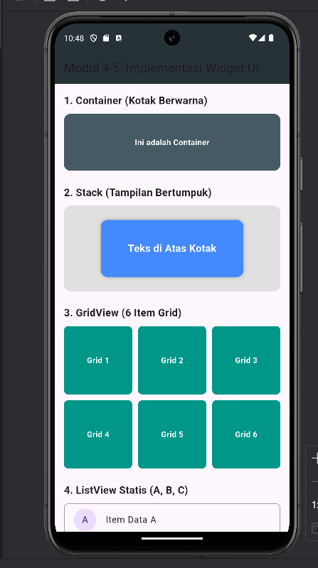
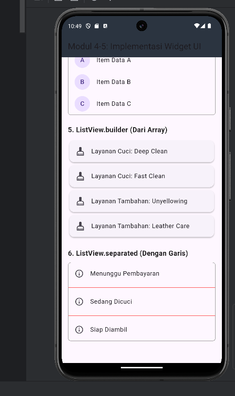
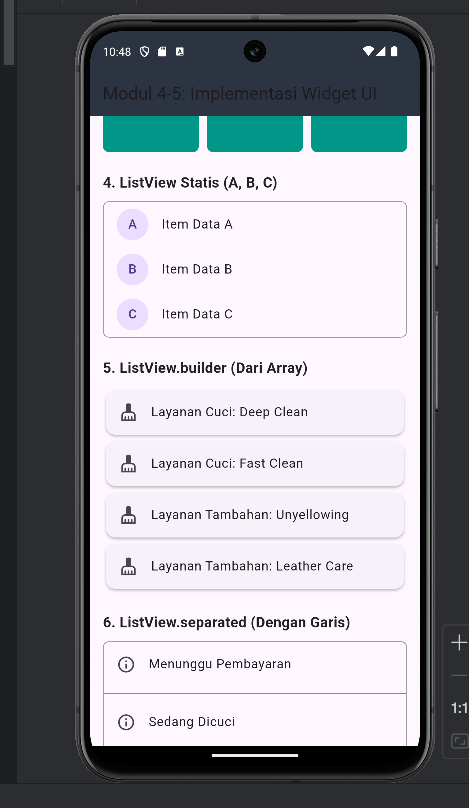

<div align="center">
  <br />

  <h1>LAPORAN PRAKTIKUM <br>APLIKASI BERBASIS PLATFORM</h1>

  <br />

  <h3>MODUL 4 & 5<br>Antar Muka Pengguna Flutter</h3>

  <br />

  

  <br /><br />

  <h3>Disusun Oleh:</h3>

  <p>
    <strong>Yesika Widiyani</strong><br>
    <strong>2311102195</strong><br>
    <strong>S1 IF-11-04</strong>
  </p>

  <br />

  <h3>Dosen Pengampu:</h3>

  <p><strong>Cahyo Prihantoro, S.Kom., M.Eng.</strong></p>

  <br />

  <h3>PROGRAM STUDI S1 INFORMATIKA<br>DIREKTORAT KAMPUS PURWOKERTO<br>UNIVERSITAS TELKOM<br>2026</h3>
</div>

---

# 1. Judul Praktikum

Implementasi Widget Antar Muka Pengguna Menggunakan Flutter

---

# 2. Tujuan Praktikum

Tujuan dari praktikum ini adalah:

1. Memahami penggunaan widget dasar pada Flutter.
2. Menerapkan widget `Container` untuk membuat tampilan berbentuk kotak berwarna.
3. Menerapkan widget `GridView` untuk menampilkan data dalam bentuk grid.
4. Menerapkan widget `ListView`, `ListView.builder`, dan `ListView.separated` untuk menampilkan data berbentuk daftar.
5. Menerapkan widget `Stack` untuk membuat tampilan bertumpuk.
6. Membuat tampilan aplikasi yang dapat digulir menggunakan `SingleChildScrollView`.

---

# 3. Deskripsi Aplikasi

Project ini merupakan aplikasi Flutter sederhana yang dibuat untuk menampilkan beberapa widget antarmuka pengguna. Widget yang digunakan meliputi `Container`, `Stack`, `GridView`, `ListView`, `ListView.builder`, dan `ListView.separated`.

Tema data pada aplikasi ini menggunakan simulasi layanan cuci sepatu. Data layanan ditampilkan menggunakan `ListView.builder`, sedangkan data status pesanan ditampilkan menggunakan `ListView.separated`. Seluruh widget ditempatkan dalam `SingleChildScrollView` agar tampilan dapat digulir dan tidak mengalami overflow pada layar perangkat.

---

# 4. Struktur Project

```text
2311102195-YESIKA WIDIYANI-MODUL-4-5-FLUTTER
├── android
├── images
│   ├── container-stack-grid.png
│   ├── list-separated.png
│   └── liststatis-builder.png
├── ios
├── lib
│   └── main.dart
├── linux
├── macos
├── test
│   └── widget_test.dart
├── web
├── windows
├── pubspec.yaml
├── README.md
└── LAPORAN_PRAKTIKUM.md
```

---

# 5. Source Code Utama

File utama aplikasi terdapat pada:

```text
lib/main.dart
```

Kode pada file tersebut berisi `PraktikumModulApp`, `TugasScreen`, dan `JudulSection`. `PraktikumModulApp` berfungsi sebagai root aplikasi, `TugasScreen` berfungsi sebagai halaman utama, sedangkan `JudulSection` digunakan sebagai widget pembantu agar judul setiap bagian tampilan lebih rapi dan tidak ditulis berulang-ulang.

---

# 6. Penjelasan Widget

## 6.1 Container

`Container` digunakan untuk membuat kotak berwarna dengan ukuran, warna, dan radius tertentu. Pada aplikasi ini, `Container` digunakan untuk menampilkan kotak berwarna biru keabu-abuan dengan teks di bagian tengah.

## 6.2 Stack

`Stack` digunakan untuk menyusun beberapa widget secara bertumpuk. Pada aplikasi ini, `Stack` digunakan untuk membuat tampilan kotak abu-abu sebagai latar belakang, kotak biru sebagai objek di tengah, dan teks di atas kotak tersebut.

## 6.3 GridView

`GridView.count` digunakan untuk menampilkan enam item dalam bentuk grid. Setiap item ditampilkan sebagai kotak berwarna hijau kebiruan dengan teks `Grid 1` sampai `Grid 6`.

## 6.4 ListView Statis

`ListView` digunakan untuk menampilkan tiga data statis, yaitu item A, B, dan C. Setiap data ditampilkan menggunakan `ListTile` dengan `CircleAvatar` di bagian kiri.

## 6.5 ListView.builder

`ListView.builder` digunakan untuk menampilkan data dari array. Pada aplikasi ini, data yang ditampilkan berupa layanan cuci sepatu, seperti `Deep Clean`, `Fast Clean`, `Unyellowing`, dan `Leather Care`.

## 6.6 ListView.separated

`ListView.separated` digunakan untuk menampilkan daftar data dengan garis pembatas antar item. Pada aplikasi ini, data yang ditampilkan berupa status pesanan, yaitu `Menunggu Pembayaran`, `Sedang Dicuci`, dan `Siap Diambil`.

---

# 7. Output Program

## 7.1 Tampilan Container, Stack, dan GridView



## 7.2 Tampilan ListView.builder dan ListView.separated



## 7.3 Tampilan ListView Statis dan ListView.builder



---

# 8. Cara Menjalankan Project

Pastikan Flutter sudah terpasang di laptop. Cek dengan perintah berikut:

```bash
flutter --version
```

Setelah itu jalankan langkah berikut:

```bash
flutter pub get
flutter run
```

Jika ingin menjalankan di browser Chrome:

```bash
flutter run -d chrome
```

Jika ingin melihat daftar perangkat yang tersedia:

```bash
flutter devices
```

Jika ingin mengecek masalah konfigurasi Flutter:

```bash
flutter doctor
```

---

# 9. Langkah Masukkan ke Git

Jalankan perintah berikut dari folder utama repository Git, misalnya folder `ABP`:

```bash
git status
git add "2311102195-YESIKA WIDIYANI-MODUL-4-5-FLUTTER/"
git status
git commit -m "Menambahkan tugas Flutter Modul 4 dan 5 Yesika"
git push origin master
```

Jika push ditolak karena repository GitHub lebih baru, jalankan:

```bash
git pull --rebase origin master
git push origin master
```

Catatan: jangan menggunakan `git add .` jika masih ada folder lain yang belum jelas statusnya, karena file lain bisa ikut masuk ke commit.

---

# 10. Kesimpulan

Berdasarkan praktikum yang telah dilakukan, aplikasi Flutter berhasil dibuat untuk menampilkan beberapa widget antarmuka pengguna. Widget `Container`, `Stack`, `GridView`, `ListView`, `ListView.builder`, dan `ListView.separated` dapat digunakan untuk membangun tampilan aplikasi yang lebih terstruktur. Penggunaan `SingleChildScrollView` juga membantu tampilan agar tetap dapat diakses dengan baik saat konten melebihi ukuran layar.
