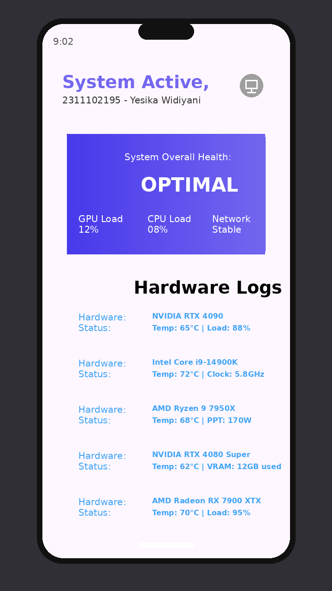

# Laporan Tugas 9 Flutter - Layout 2

## Identitas

Nama: Yesika Widiyani  
NIM: 2311102195  
Kelas: S1 IF-11-04  
Mata Kuliah: Aplikasi Berbasis Platform

## Deskripsi

Project ini merupakan implementasi Tugas 9.1 Layout 2 menggunakan Flutter. Aplikasi menampilkan halaman monitoring kesehatan sistem komputer dengan header identitas, kartu status berbentuk gradient, dan daftar log hardware menggunakan struktur data `List<Map>` serta `ListView.builder`.

## Output



## Langkah Menjalankan

```bash
flutter pub get
flutter devices
flutter run -d chrome
```

Jika ingin menjalankan di emulator Android atau perangkat Android:

```bash
flutter run
```

## Langkah Memasukkan ke Git

Jalankan dari folder repo utama `ABP`:

```bash
git status
git add "Tugas9_Layout2_2311102195_Yesika_Widiyani/"
git status
git commit -m "Menambahkan Tugas 9 Layout 2 Yesika Widiyani"
git push origin master
```

Jika push ditolak:

```bash
git pull --rebase origin master
git push origin master
```

Jangan menggunakan `git add .` jika masih ada folder lain yang belum jelas statusnya.
